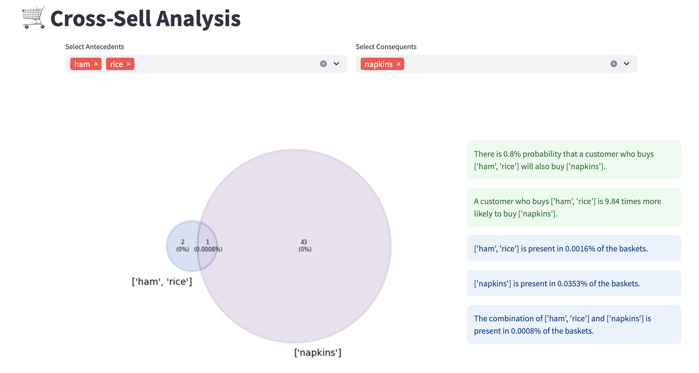

# 🛒 Cross-Sell Analysis Dashboard

This Streamlit app provides a Cross-Sell Analysis based on the association rules generated from the Groceries dataset. It allows users to select Antecedents and Consequents to visualize the intersection and provide insights into the presence of these items in the dataset.

Association rules have been generated in R. Dashboard is created in Python's Streamlit.

## Features

- **Data Loading**: Reads the Groceries dataset and displays the first few rows.
- **Association Rules**: Converts the dataset into transactions and generates association rules using Apriori algorithm.
- **Interactive Selection**: Allows users to select Antecedents and Consequents from the unique items present in the dataset.
- **Venn Diagram Visualization**: Visualizes the intersection of selected Antecedents and Consequents using a Venn diagram.
- **Percentage Insights**: Displays the percentage of presence of selected items in the dataset.

## Dashboard Snippet

## Usage

1. **Select Antecedents and Consequents**: Choose the items from the dropdown list.
2. **View Results**: Once selected, the app displays the Venn diagram and insights based on the selected items.
